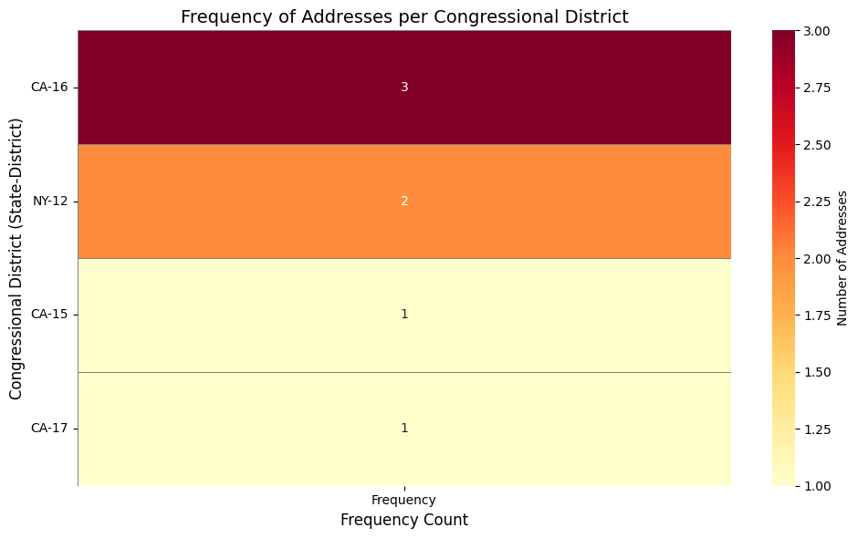

# Geomap Project

This repository contains a Python-based project for geocoding and data visualization using the Geocodio API and popular Python libraries.

## Installation Instructions

Follow these steps to set up the project:

### 1. Install Python
Ensure you have Python 3.7 or later installed. You can download it from the [official Python website](https://www.python.org/downloads/).

### 2. Set Up a Virtual Environment
Create and activate a virtual environment:

```bash
# Create a virtual environment
python -m venv venv

# Activate the virtual environment
# On Windows:
venv\Scripts\activate
# On macOS/Linux:
source venv/bin/activate
```

### 3. Install Required Modules
Install the required Python modules using `pip`:

```bash
./.venv/bin/python -m pip install python-dotenv pandas seaborn matplotlib pygeocodio
```

## Example `.env` File

Create a `.env` file in the root of your project directory and add the following content:

```env
GEOCODIO_API_KEY=your_geocodio_api_key_here
```

Replace `your_geocodio_api_key_here` with your actual Geocodio API key.

## Sample Output

Below is an example of the output generated by the project:



See also [geomap.html](geomap.html) and [geomap.pdf](geomap.pdf).

## Notes
- Ensure your `.env` file is not committed to version control to keep your API key secure.
- For more information on the Geocodio API, visit the [Geocodio documentation](https://www.geocod.io/docs/).
- Visit the [Pygeocodio documentation](https://pygeocodio.readthedocs.io/en/latest/geocode.html#batch-geocoding) for information on batch processing
- Remember the Geocodio API Free tier **only includes 2500 lookups/day**.

Enjoy working with the Geomap Project!
